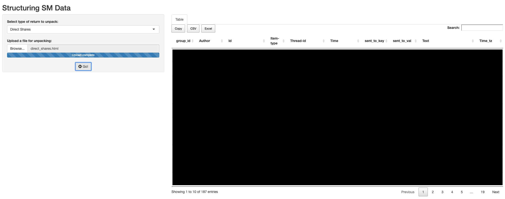

COREmisc
================

<!-- badges: start -->

[](https://travis-ci.org/NPSCORELAB/COREmisc)
<!-- badges: end -->

## Installation

1.  Install `devtools` if you haven’t already.

<!-- end list -->

``` r
install.packages("devtools")
```

2.  Install the package using `devtools`.

<!-- end list -->

``` r
devtools::install_github("NPSCORELAB/COREmisc", force = TRUE)
```

## Using Functions Locally

``` r
html      <- COREmisc:::get_html("PATH/TO/YOUR/DATA.html")
table_out <- COREmisc::extract_shares(html)
```

    ## # A tibble: 187 x 10
    ##    group_id Author Id    `Item-type` `Thread-id` Time  sent_to_key
    ##       <int> <chr>  <chr> <chr>       <chr>       <chr> <chr>      
    ##  1        1 danie… 2.77… link        3.40282366… 2017… Recipients 
    ##  2        1 danie… 2.77… link        3.40282366… 2017… Recipients 
    ##  3        7 dee(5… 2.78… text        3.40282366… 2017… Recipients 
    ##  4        7 dee(5… 2.78… text        3.40282366… 2017… Recipients 
    ##  5       14 eric … 2.78… text        3.40282366… 2017… Recipients 
    ##  6       14 eric … 2.78… text        3.40282366… 2017… Recipients 
    ##  7       21 dee(5… 2.78… text        3.40282366… 2017… Recipients 
    ##  8       21 dee(5… 2.78… text        3.40282366… 2017… Recipients 
    ##  9       28 eric … 2.78… text        3.40282366… 2017… Recipients 
    ## 10       28 eric … 2.78… text        3.40282366… 2017… Recipients 
    ## # … with 177 more rows, and 3 more variables: sent_to_val <chr>,
    ## #   Text <chr>, Time_tz <dttm>

## Launching Apps Locally

**{COREmisc}** apps

``` r
COREmisc::launch_shiny_app(.app         = "relational_data_structure",
                           .use_browser = TRUE)
```

<!-- -->
